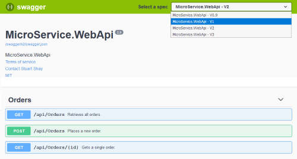

# Microservice API

[](https://github.com/stuartshay/MicroService/actions/workflows/actions.yml) [](https://hub.docker.com/r/stuartshay/microservice-api/) [](https://codecov.io/gh/stuartshay/MicroService)

## NYC Open Data GeoSpatial & Data Enrichment API

## Intro

This repository holds the backend API for the NYC Open Data GeoSpatial & Data Enrichment API. The API is a microservice that is used to enrich data with geospatial data and other data sources.

## Technology Stack

### Purpose

The New York Application Team has been tasked with designing a microservice for their Enrichment Data pipeline which will be utilized by high profile clients and internal groups in the organization for Machine Learning Research and the Geospatial Engine Product.

The Application will be a complete rearchitected solution using the cloud for optimal price and performance. The API Schema has been enhanced and key performance metrics have been added. The API will implement versioning so end clients can seamlessly update to the new enhanced schema when ready.

The Requirements for this project can be viewed at the following.

- [Business Requirements](/docfx/articles/requirements.md)
- [C# Coding Standards](/docfx/articles/csharp_coding_standards.md)

## Swagger



## Hosting Environments

### Development

Local Docker Postgres Database

```
cd docker
docker-compose -f docker-compose-local.yml -f docker-compose-metrics.yml pull
docker-compose -f docker-compose-local.yml -f docker-compose-metrics.yml up
```

AWS Postgres Development Database

```
cd docker
docker-compose -f docker-compose-development.yml pull
docker-compose -f docker-compose-development.yml up
```

Swagger API Documentation Page

```
http://<DOCKER_HOST>:5000/swagger/
```

### MyGet/NuGet Packages

| Package              | Status                                                                                                                                                       |
| -------------------- | ------------------------------------------------------------------------------------------------------------------------------------------------------------ |
| MicroService.Data    | [](https://www.myget.org/feed/microservice/package/nuget/MicroService.Data)       |
| MicroService.Service | [](https://www.myget.org/feed/microservice/package/nuget/MicroService.Service) |

### Jenkins Build Status

| Jenkins               | Status                                                                                                                                                                                          |
| --------------------- | ----------------------------------------------------------------------------------------------------------------------------------------------------------------------------------------------- |
| Docker Base Image     | [](https://jenkins.navigatorglass.com/job/MicroService/job/microservice-api-base/)   |
| Docker Deploy Image   | [](https://jenkins.navigatorglass.com/job/MicroService/job/microservice-api-build/) |
| Docker x86/Arm7 Image | [](https://jenkins.navigatorglass.com/job/MicroService/job/microservice-api-multi/) |

### Build Commands

| Build Type        | Linux/Mac                    | Windows                       |
| ----------------- | ---------------------------- | ----------------------------- |
| CI Build          | ./build.sh --target=CI-Build | .\build.ps1 --target=CI-Build |
| SonarQube Testing | ./build.sh --target=sonar    | .\build.ps1 --target=sonar    |

**docfx**

```powershell
docfx docfx/docfx.json
docfx docfx/docfx.json -p 9090 --serve

http://localhost:9090
```

## Sonar

```
dotnet sonarscanner begin /k:"MicroService.Api" /d:sonar.host.url="http://192.168.1.172:9100" /d:sonar.exclusions=Program.cs,**/Extensions/**/*.cs  /d:sonar.cs.vscoveragexml.reportsPaths=coverage.xml /d:sonar.login="sqp_b0b06eef83dbde81db33f8db66c89554c41f9831"
dotnet build --no-incremental
dotnet-coverage collect 'dotnet test' -f xml  -o 'coverage.xml'
dotnet sonarscanner end /d:sonar.login="sqp_b0b06eef83dbde81db33f8db66c89554c41f9831"
```
