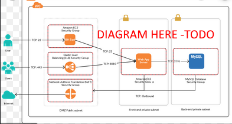
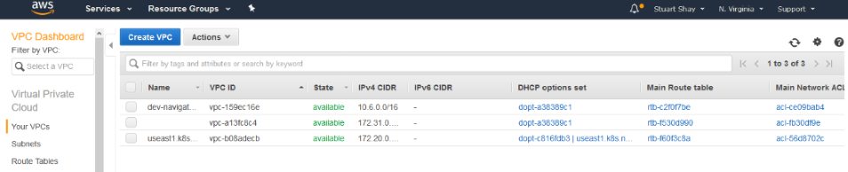
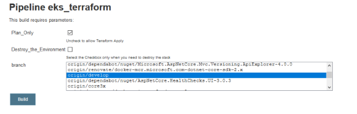

# MicroService Kubernetes Build and Deployment Pipeline

## Stages

```
VPC_Module >> EKS_Module >> Helm_Charts
```

## VPC Module

### Virtual Private Cloud (Amazon VPC)

Provisions the Network Resources such as the Gateway, Subnets and Routing Rules



### VPC Jenkins Job


```
1. Plan_Only: to plan the tf-modules, and then select “ branch” name.

2. Destroy_the_Environment: destroy the deployed tf-modules and then select “ branch” name.

3. And if you want to deploy tf-modules just only select the “ branch ”.
```

### AWS Management Console



## EKS Module

### Elastic Kubernetes Service (Amazon EKS)

EKS runs the Kubernetes management infrastructure

### EKS Jenkins Job




## Helm Charts
