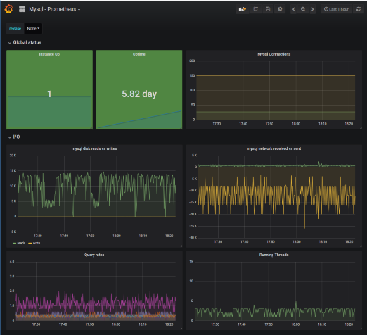
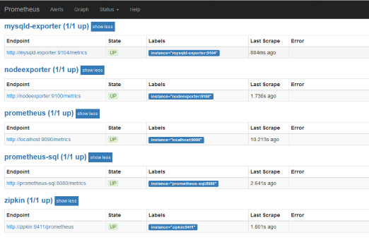

## Docker Files 

### Local Mode 
```
cd docker
docker-compose -f docker-compose-local.yml -f docker-compose-metrics.yml pull
docker-compose -f docker-compose-local.yml -f docker-compose-metrics.yml up
```

#### Destroy
```
docker-compose -f docker-compose-local.yml -f docker-compose-metrics.yml down
docker volume prune
```

### Cluster Mode
```
cd docker
docker-compose -f docker-compose-cluser.yml --scale api=4
```

## Grafana UI

```
http://grafana:3000
```

#### Documentation
https://grafana.com/





## Prometheus

```
http://prometheus:9090
```
```
Targets
http://prometheus:9090/targets

Graph
http://prometheus:9090/graph

```
#### Documentation
https://prometheus.io/



