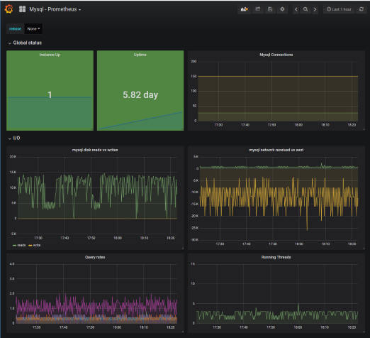
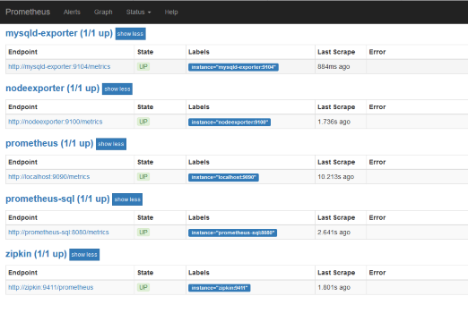

# Docker Files

## Local Mode

```
cd docker
docker-compose -f docker-compose-local.yml -f docker-compose-metrics.yml -f docker-compose-logging.yml -f docker-compose-tracing.yml pull
docker-compose -f docker-compose-local.yml -f docker-compose-metrics.yml -f docker-compose-logging.yml -f docker-compose-tracing.yml up
```

### Destroy

```
docker-compose -f docker-compose-local.yml -f docker-compose-metrics.yml -f docker-compose-tracing.yml down
docker volume prune
```

## Cluster Mode

```
make certificates
cd docker
docker-compose -f docker-compose-cluster.yml pull
docker-compose -f docker-compose-cluster.yml up --scale api=4
```

`make certificates` creates a self-signed certificate for local development.
The generated certificate and private key are intentionally excluded from Git.

## Grafana UI

```
http://grafana:3000
```

### Documentation

<https://grafana.com/>



## Prometheus

```
http://prometheus:9090
```

```
Targets
http://prometheus:9090/targets

Graph
http://prometheus:9090/graph

```

### Prometheus Documentation

<https://prometheus.io/>



## Tag & Push Google Cloud Repository

Tag

```
docker tag  5eab36ab4873  \
us-east4-docker.pkg.dev/velvety-byway-327718/microservice-api/microservice-api:5.0.1-build.113
```

Push

```
docker push us-east4-docker.pkg.dev/velvety-byway-327718/microservice-api/microservice-api:5.0.1-build.113
```
